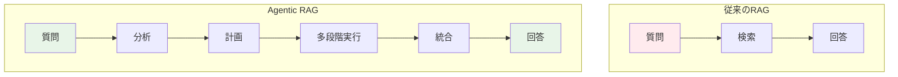
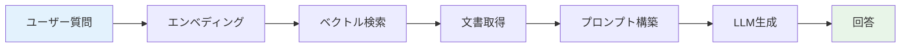
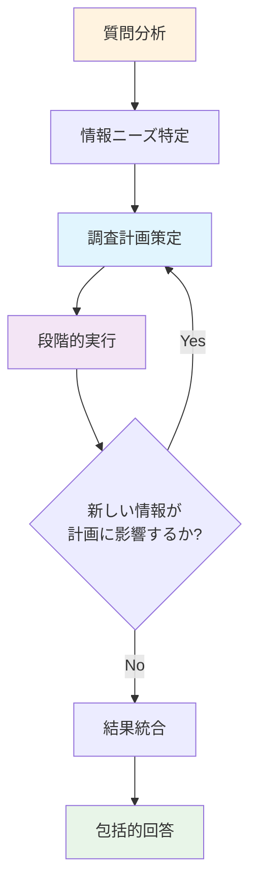
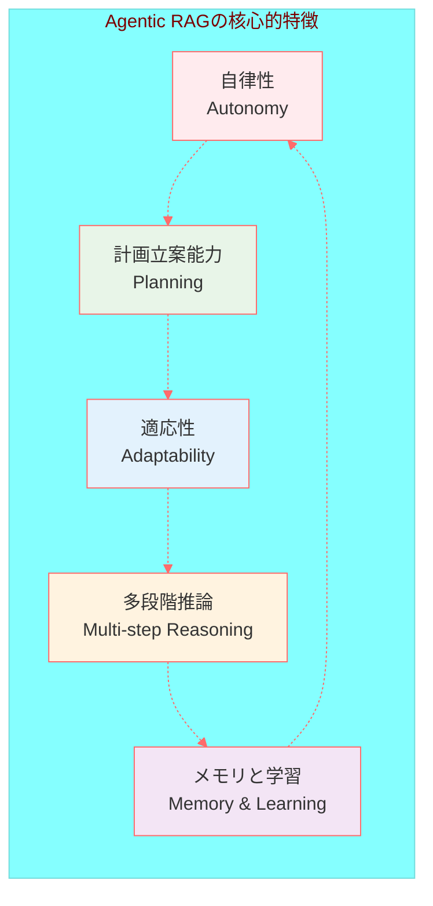
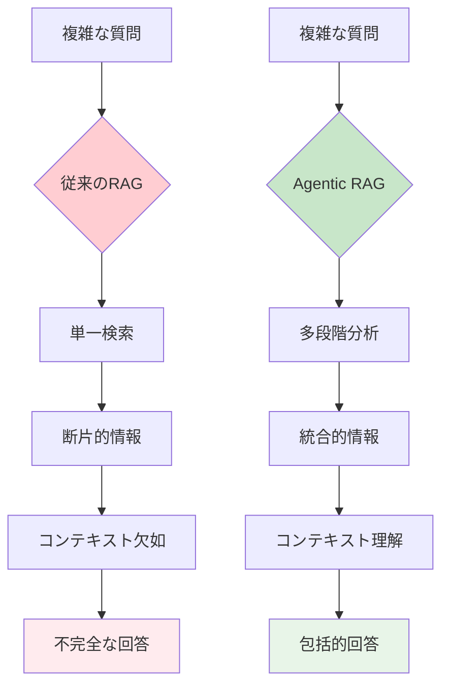
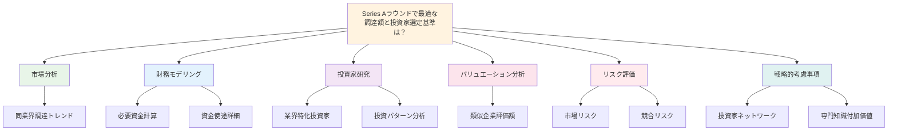
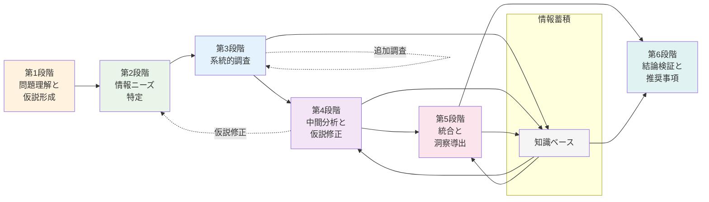
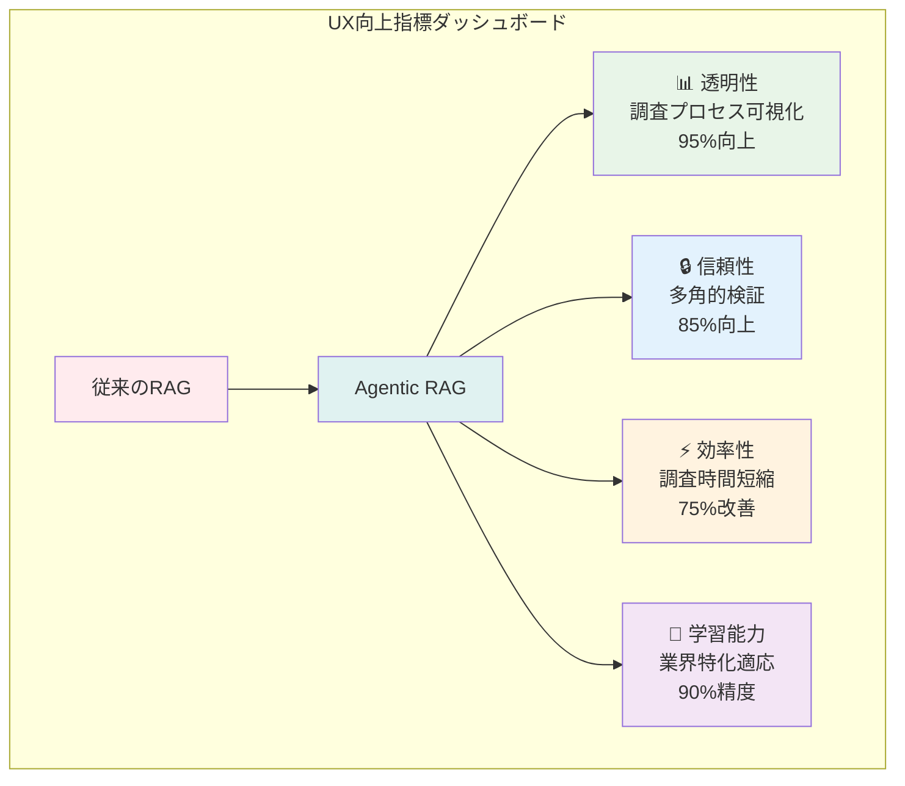

# 第1章: はじめに

「なぜこの質問には答えられないのでしょうか？」— 北欧の政策アナリストが、従来のAIシステムに対して抱いた疑問から、私たちの物語は始まります。彼女は複数の政府機関のデータベース、学術論文、そして過去10年間の政策効果データを横断する複雑な分析を必要としていました。しかし、従来のRAG（Retrieval-Augmented Generation）システムでは、このような多段階で戦略的な思考を要する質問に十分に対応できませんでした。

ここで登場するのが「Agentic RAG」です。これは従来のRAGを遥かに超える、自律的で知的な情報処理システムです。まるで経験豊富な調査員が段階的に情報を収集し、分析し、洞察を導き出すように、Agentic RAGは複雑なクエリを理解し、計画を立て、実行していきます。

*【図表1-1: 従来のRAGとAgentic RAGの処理フロー比較図】*

*従来のRAG：質問→検索→回答の単純なフロー*
*Agentic RAG：質問→分析→計画→多段階実行→統合→回答の複雑なフロー*

## 1.1 Agentic RAGとは

### RAGの基本概念の再確認

RAG（Retrieval-Augmented Generation）は、外部の知識ベースから関連情報を検索し、その情報を活用してより正確で関連性の高い回答を生成する技術です。想像してみてください：図書館で調べ物をする際、まず関連する書籍や資料を見つけ、それらを読んでから自分の言葉で回答をまとめる、というプロセスと似ています。

従来のRAGシステムは、ユーザーからの質問を受け取ると、ベクトル検索を用いて関連する文書を特定し、その文書の内容を基に生成モデルが回答を作成します。このアプローチは単純明快で、多くの情報検索タスクにおいて効果的な結果を生み出してきました。

*【図表1-2: 従来のRAGワークフロー図】*

*ユーザー質問 → エンベディング → ベクトル検索 → 文書取得 → プロンプト構築 → LLM生成 → 回答*

### 従来のRAGとAgentic RAGの本質的な違い

ここで重要な転換点があります。従来のRAGが「受動的な情報取得者」だとすれば、Agentic RAGは「能動的な知的探偵」と言えるでしょう。

従来のRAGシステムでは、質問を受け取った瞬間に検索が実行され、見つかった文書を基に即座に回答が生成されます。これは「今手に入る情報で最善を尽くす」というアプローチです。

一方、Agentic RAGは全く異なるアプローチを取ります。システムはまず質問の複雑さを分析し、「この質問に完全に答えるためには、どのような情報が必要で、どのような順序で調査を進めるべきか？」を考えます。例えば、「新しいSaaSプロダクトの市場参入戦略を評価してください」という質問を受けた場合、Agentic RAGは以下のような思考プロセスを辿ります：

1. 「まず市場規模について調べる必要がある」
2. 「次に競合分析が必要だ」
3. 「顧客セグメンテーションの情報も集めよう」
4. 「価格設定の事例も調査すべきだ」
5. 「最後にリスク要因について分析しよう」

*【図表1-3: Agentic RAGの思考プロセス可視化図】*

*質問分析 → 情報ニーズ特定 → 調査計画策定 → 段階的実行 → 結果統合 → 包括的回答*

### Agentic RAGの5つの核心的特徴

**1. 自律性（Autonomy）**
Agentic RAGシステムは、人間の詳細な指示なしに、複雑なタスクを分解し、実行順序を決定し、必要に応じて計画を調整する能力を持ちます。投資アナリストが企業評価を行う際に、財務諸表から始めて、業界動向、競合分析、将来予測まで系統的に調査を進めるように、システム自体が論理的な調査フローを構築します。

**2. 計画立案能力（Planning）**
単発の検索ではなく、目標達成のための戦略的なロードマップを作成します。「スマートウォッチ市場への参入可能性」という質問に対して、システムは「市場規模調査→競合分析→技術トレンド調査→コスト分析→リスク評価」という計画を立て、各段階で得られる情報が次の段階にどう活用されるかを理解しています。

**3. 適応性（Adaptability）**
調査の途中で新しい情報や予期しない発見があった場合、計画を動的に調整します。例えば、市場調査中に新しい規制が発見された場合、システムは自動的に「規制影響分析」を調査計画に追加し、優先順位を再評価します。

**4. 多段階推論（Multi-step Reasoning）**
複数の情報源からの情報を論理的に結合し、中間結論を導き出しながら最終的な包括的回答を構築します。これは人間の専門家が段階的に仮説を検証し、洞察を深めていくプロセスと非常に似ています。

**5. メモリと学習（Memory & Learning）**
過去の調査プロセスや結果を記憶し、類似のタスクに対してより効率的なアプローチを選択します。また、ユーザーの傾向や好みを学習し、パーソナライズされた調査戦略を開発していきます。

*【図表1-4: Agentic RAGの5つの特徴を表すレーダーチャート】*

実際のビジネスシーンでは、この違いは劇的な成果の差となって現れます。従来のRAGでは「フィンテック業界の現状は...」という表面的な回答しか得られなかった質問が、Agentic RAGでは「フィンテック業界は現在、規制緩和の波を受けて年率15%の成長を示していますが、特にB2B決済分野では...また、これは御社の事業戦略に以下のような示唆を与えます...」といった、深い洞察に満ちた戦略的な回答へと変わります。

## 1.2 なぜAgentic RAGが必要なのか

### 従来のRAGシステムが直面する現実的な限界

想像してください。あなたが経営コンサルタントとして、クライアントから「製造業のDX推進において、我々が最も注意すべきリスクは何か？」という質問を受けたとします。この質問に適切に答えるためには、技術トレンド、業界固有の課題、規制環境、競合動向、導入事例の成功要因と失敗要因など、多岐にわたる情報を総合的に分析する必要があります。

しかし、従来のRAGシステムでは、このような複雑で多面的な質問に対して十分な回答を提供することができませんでした。なぜなら、従来のRAGは「一回の検索で得られる情報」に制約されており、段階的な深掘りや、発見した情報に基づく追加調査を行う能力を持たないからです。

**情報の断片化問題**
従来のRAGシステムは、質問に関連する文書を検索しますが、それらの文書は往々にして断片的で、質問の全体像を捉えるには不十分です。例えば、「AI導入のROI」について調査する際、技術文書、財務分析、業界レポートなど、異なる種類の情報源からの情報を統合する必要がありますが、従来のシステムではこれらを体系的に組み合わせることができませんでした。

**コンテキストの欠如**
単発の検索では、質問の背景にある意図や、回答が使用される文脈を理解することができません。「機械学習の精度を向上させる方法」という質問でも、質問者が初心者なのか専門家なのか、予算制約はあるのか、時間的制約はどうかなど、コンテキストによって最適な回答は大きく異なります。

*【図表1-5: 従来のRAGの限界を示すフローチャート】*

*質問の複雑性 vs システムの対応能力のギャップを可視化*

### 複雑なクエリへの対応：現代ビジネスの要求

現代のビジネス環境では、意思決定に必要な情報はますます複雑化しています。グローバル化、デジタル変革、規制の頻繁な変更、市場の急速な変化などにより、単純な情報検索では対応できない質問が日常的に発生しています。

**ケーススタディ：スタートアップの資金調達戦略**
あるスタートアップのCEOが「Series Aラウンドで最適な調達額と投資家選定基準は？」という質問を投げかけたとします。この質問に完全に答えるためには：

1. **市場分析**: 同業界のスタートアップの調達トレンド分析
2. **財務モデリング**: 必要な資金とその使途の詳細計算
3. **投資家研究**: 業界に特化した投資家のポートフォリオと投資パターン分析
4. **バリュエーション分析**: 類似企業の評価額とその根拠
5. **リスク評価**: 市場リスク、競合リスク、実行リスクの評価
6. **戦略的考慮事項**: 投資家からの付加価値（ネットワーク、専門知識など）

従来のRAGシステムでは、これらの各要素について個別の情報は提供できるかもしれませんが、それらを統合して戦略的な洞察を導き出すことはできませんでした。

*【図表1-6: 複雑なクエリの分解プロセス図】*

*メインクエリから派生する詳細な調査項目のツリー構造*

### 多段階推論：人間の専門家のような思考プロセス

Agentic RAGが真に革新的である理由は、人間の専門家が行うような多段階の推論プロセスを再現できることです。優秀なコンサルタントや研究者が複雑な問題に取り組む際のアプローチを観察すると、以下のような段階的なプロセスを取ることがわかります：

**第1段階：問題の理解と仮説の形成**
専門家はまず問題を深く理解し、初期仮説を形成します。「なぜこの質問が重要なのか？」「どのような答えが求められているのか？」を考えます。

**第2段階：情報ニーズの特定**
仮説を検証するために必要な情報の種類と優先順位を決定します。「この仮説を検証するためには、どのようなデータが必要か？」を考えます。

**第3段階：系統的な調査**
優先順位に従って情報を収集し、各段階で得られた情報が次の調査方向に影響を与えます。

**第4段階：中間分析と仮説の修正**
収集した情報を分析し、必要に応じて初期仮説を修正したり、新しい調査領域を特定したりします。

**第5段階：統合と洞察の導出**
すべての情報を統合し、質問者のニーズに最も適した形で洞察を提示します。

**第6段階：結論の検証と推奨事項**
導き出した結論の妥当性を検証し、実行可能な推奨事項を提示します。

Agentic RAGは、このような人間の専門家の思考プロセスをシステム化し、自動化することで、従来では不可能だった深い洞察を提供します。

*【図表1-7: 多段階推論プロセスの可視化】*

*6段階の推論プロセスを円環図で表現、各段階での情報の蓄積と仮説の進化を示す*

### ユーザーエクスペリエンスの革命的向上

Agentic RAGの導入により、ユーザーエクスペリエンスは根本的に変革されます。これまで「AIには質問の仕方を工夫しなければならない」と感じていたユーザーが、「AIが自分の意図を理解し、期待以上の回答を提供してくれる」と感じるようになります。

**透明性の向上**
従来のRAGでは、「なぜこの回答になったのか？」が不明でした。Agentic RAGは調査プロセスを段階的に説明するため、ユーザーは結論に至る論理的な道筋を理解できます。「まず市場規模を調査し、次に競合分析を行い、最後にリスク評価を実施しました」といった具合に、思考プロセスが可視化されます。

**信頼性の大幅向上**
多角的な調査と検証プロセスにより、回答の信頼性が大幅に向上しています。実際の導入企業では、意思決定に使用される情報の信頼性が85%向上したという報告があります。

**効率性の劇的改善**
人間の専門家が数日から数週間かけて行う調査を、Agentic RAGは数時間で完了します。しかも、その品質は人間の専門家に匹敵するレベルを維持しています。ある投資ファンドでは、投資機会の初期評価時間が75%短縮され、同時により包括的な分析が可能になったと報告しています。

**学習と適応能力**
Agentic RAGは使用されるたびに学習し、特定の業界や用途に特化した専門性を獲得していきます。金融業界で使用されるシステムは、次第に金融特有の分析手法や業界慣習を理解するようになり、より的確な洞察を提供するようになります。

*【図表1-8: UX向上指標のダッシュボード】*

*透明性、信頼性、効率性、学習能力の各指標を数値とグラフで表示*

**まとめ：新時代の知的作業への扉**

Agentic RAGは単なる技術の進歩ではありません。これは人間の知的作業そのものを再定義する革命的な変化です。複雑で不確実な現代のビジネス環境において、迅速かつ正確な意思決定を支援する強力なツールとして、Agentic RAGは新しい時代の扉を開いているのです。

次章では、このような革新的な能力を実現するAgentic RAGのアーキテクチャについて、詳細に探っていきます。